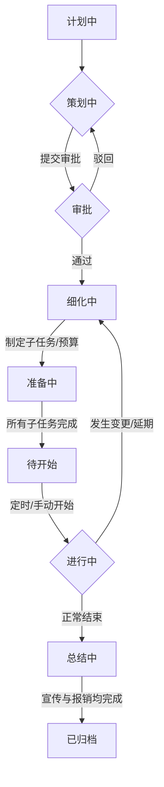
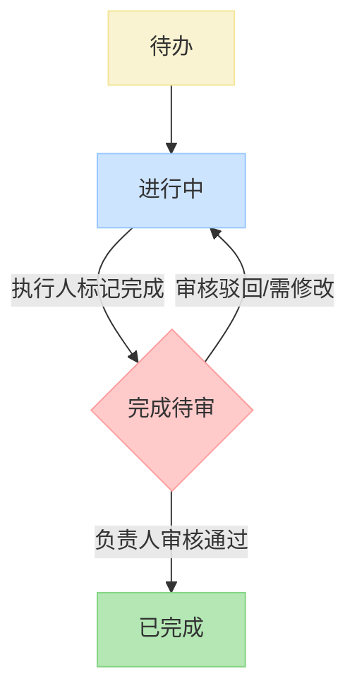
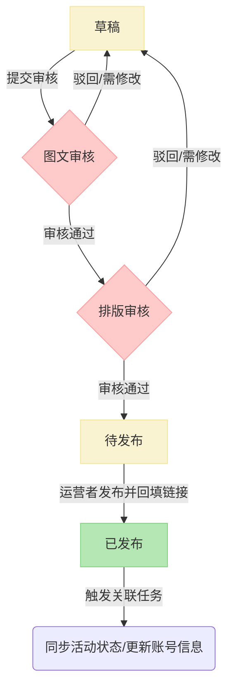
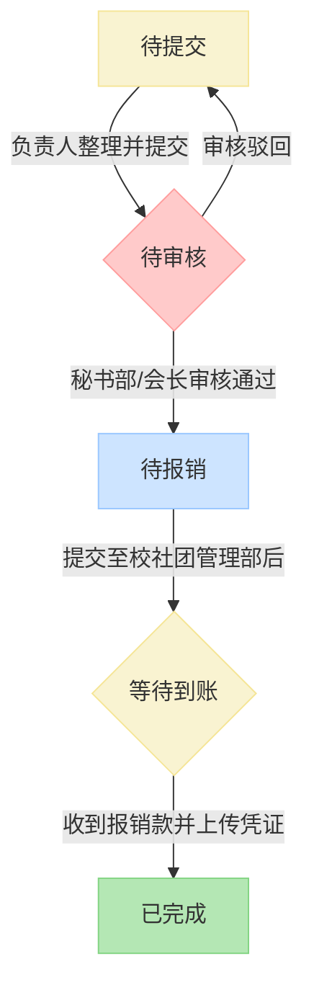
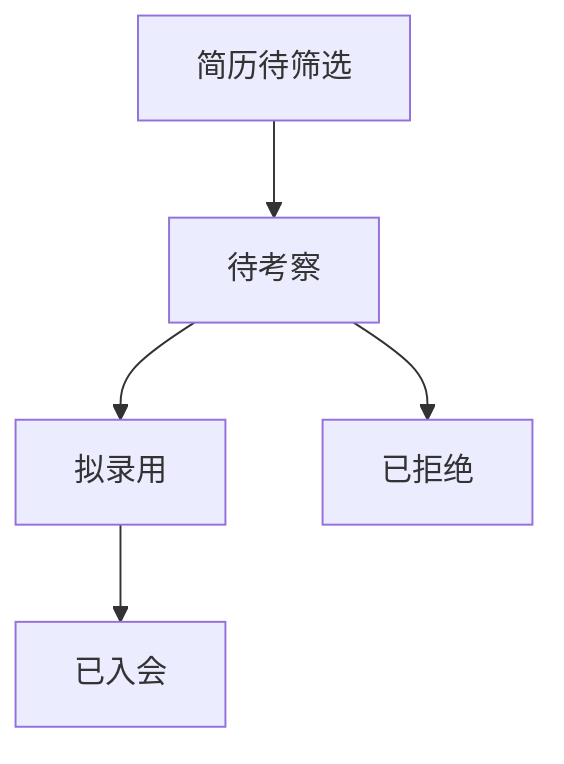

### **NWUCA 运行管理系统需求说明**

#### **1. 引言**

##### **1.1. 项目背景**

为解决西北大学计算机与网络空间安全协会（NWUCA）在日常运营中面临的组织管理、信息协同、活动流程及资产追踪等方面的挑战，特开发此集成化、智能化、流程化的运行管理系统。

##### **1.2. 系统目标**

* **效率提升**: 自动化重复性工作，简化审批流程，减少人力成本。
* **标准化**: 固化协会优秀工作流程，形成标准操作程序 (SOP)。
* **数据化**: 沉淀组织数据资产，为决策提供数据支持，实现知识传承。
* **协同化**: 打破信息孤岛，构建统一协作平台，提升团队协同效率。

---

#### **2. 组织管理模块 (Core HR)**

##### **2.1. 人员信息库**

* **功能描述**: 统一管理协会所有相关人员（会员、指导老师）的电子档案。
* **功能点**:
  1. **会员档案 (`Members`)**:
     * **视图**: 提供列表视图（支持搜索、筛选、排序）和个人详情视图。
     * **字段**: `member_id`, `user_id`, `name`, `student_id`, `grade`, `college`, `major`, `phone`, `email`, `join_date`, `expected_graduation_date`, `status` (在读, 已毕业, 休学, 退会), `avatar_url` (头像), `resume_summary` (Markdown格式), `skills` (标签化), `remarks`.
     * **操作**:
       * `创建`: 支持单人手动创建。
       * `编辑`: 拥有权限的管理员可修改成员信息。
       * `状态变更`: 可手动将会员状态在“在读”、“休学”、“退会”之间切换。毕业时间到达后，系统可自动或由管理员确认为“已毕业”。
  2. **指导老师档案 (`Advisors`)**:
     * **视图与操作**: 同会员档案。
     * **字段**: `advisor_id`, `user_id`, `name`, `college`, `department`, `title`, `phone`, `email`, `research_area`, `join_date`, `status` (在职, 离任), `avatar_url`, `remarks`.
  3. **数据导入/导出**:
     * **批量导入**:
       1. 管理员下载标准 Excel 模板。
       2. 填写信息后上传。
       3. 系统进行数据预校验（如学号、手机号格式），在界面上展示校验结果（成功、失败及原因）。
       4. 管理员确认无误后，执行导入。
     * **OCR 录入**:
       1. 用户上传学生证、身份证等证件照片。
       2. 系统调用 OCR 服务识别关键字段（姓名、学号、学院等）并自动填充到表单中。
       3. 用户核对并补充其他信息后提交。
     * **数据导出**: 支持将当前筛选结果的会员/老师信息导出为 Excel 文件。

##### **2.2. 组织架构与权责 (RBAC)**

* **功能描述**: 动态定义协会的组织结构、职务以及对应的权限。
* **功能点**:
  1. **部门管理 (`Departments`)**:
     * 提供树状结构或列表来展示和管理部门。
     * 支持增、删、改、查部门信息 (`department_id`, `name`, `description`, `parent_id`)。
     * 支持部门拖拽排序和调整层级。
  2. **职务管理 (`Positions`)**:
     * 管理职务列表 (`position_id`, `name`, `access_level`)。
     * `access_level` 为数字，用于快速判断权限高低。
  3. **任期分配 (`Assignments`)**:
     * **核心界面**: 一个可视化的分配管理界面。
     * **操作**:
       1. 选择一个会员。
       2. 点击“添加任职”。
       3. 在弹窗中选择 `任职实体`（部门/直属队）、`职务`，并设定 `任期起止时间`。
       4. 保存后，该会员即在该任期内拥有对应职务的权限。
     * **视图**: 在会员详情页，以时间线或列表形式展示其所有历史和当前的任职记录。
     * **自动化**: 系统每日检查任期，自动将到期的任职状态更新为“离任”，并剥离相应权限。

##### **2.3. 直属队管理**

* **功能描述**: 对协会下属的各个项目驱动型战队进行专项管理。
* **功能点**:
  1. **直属队信息 (`Teams`)**:
     * 管理战队基本信息，包括名称、Logo、简介、指导老师。
  2. **队内分组/项目 (`Team_Groups`)**:
     * 在每个直属队下，可以创建多个分组或项目。
     * 管理分组信息，并可将 `会员`和 `指导老师`通过 `任期分配(Assignments)`模块，分配到具体分组中，并指定组内职务（如组长、组员）。

##### **2.4. 核心流程自动化**

* **功能描述**: 将纳新、换届等关键组织活动流程化。
* **功能点**:
  1. **在线报名/纳新**:
     * 系统生成一个公开的报名链接和二维码。
     * 外部人员填写表单（可定制字段），提交后数据进入“报名者”数据池。
     * **看板视图**: 招聘负责人可以在一个类似 Trello 的看板上拖动报名者卡片，以更新其状态（如：简历筛选 -> 待笔试 -> 待面试 -> 拟录用 -> 已拒绝）。
     * **一键入会**: 对于“拟录用”的报名者，管理员可一键将其信息转为正式会员，并自动发送包含初始账号密码的欢迎邮件。
  2. **换届流程**:
     * 超级管理员在系统设置中启动“一键换届”功能。
     * **步骤**:
       1. 设置新旧任期交接日期。
       2. 系统展示当前所有任职人员列表。
       3. 管理员为新任期批量指定核心职位（如会长、副会长、各部部长）。
       4. 确认后，系统在交接日期自动将旧任期职位设为“离任”，并激活新任期职位。
       5. 所有权限根据新任期自动刷新。

---

#### **3. 基本信息管理模块 (Content Management)**

##### **3.1. 社团信息维护**

* **功能点**: 在系统后台提供一个“关于我们”的配置页面，字段包括：`社团名称`, `英文名称`, `Logo上传`, `社团简介` (富文本编辑器), `指导教师` (从教师库中选择关联)。

##### **3.2. 规章制度管理**

* **功能点**:
  * 支持按 `文件类型`（章程、部门分工、财务制度等）分类。
  * 提供文件上传接口，并记录 `版本号`、`上传者`、`上传时间`。
  * 支持在线预览 PDF 文件。
  * 历史版本可查看、下载。

##### **3.3. 工作报告与文件**

* **功能点**:
  * **在线编辑器**: 内置 Markdown 编辑器，用于撰写周报、年鉴等。支持插入图片、表格。
  * **模板功能**: 可创建和使用报告模板，规范格式。
  * **智能报告生成 (MCP)**:
    1. 用户选择报告类型（如“月度活动总结”）。
    2. 系统提供一个配置界面，让用户选择时间范围。
    3. 系统自动从 `活动模块`拉取活动列表、参与人数，从 `财务模块`拉取相关支出，从 `融媒体模块`拉取宣传成果。
    4. 将上述数据填充到报告模板中，生成一份内容详实的草稿，供用户修改。

---

#### **4. 数智运维与资产管理模块 (IT & Asset)**

##### **4.1. 资产管理**

* **功能点**:
  1. **资产台账 (`Assets`)**:
     * **视图**: 列表视图，支持按 `资产类型`、`状态`、`保管人`筛选。
     * **字段**: `asset_id`, `name`, `type`, `category`, `status`, `custodian_id`, `purchase_date`, `value`, `source`, `related_activity_id`, `image_url` (照片), `location`.
  2. **资产生命周期管理**:
     * `入库`: 活动采购的物品，在报销审批通过后，系统提示财务负责人是否要将物品转为固定资产。确认后，自动在资产台账中创建记录。
     * `领用/归还`: 成员在线申请领用，保管人审批。领用和归还均需电子签名确认，并记录在 `资产流水(Asset_Logs)`中。
     * `盘点`: 管理员可发起盘点任务，各保管人需在系统内核对名下资产状态。
     * `报废`: 资产损坏或丢失，可提交报废申请，审批通过后更新资产状态。

##### **4.2. 密码管理器**

* **功能点**:
  * **加密存储**: 所有密码在数据库中必须经过强加密存储。
  * **权限隔离**: 只有被明确授权（通过任期分配）的职务才能查看特定账号的密码。例如，“宣传部部长”可查看B站、微信公众号的密码，但不能查看服务器密码。
  * **操作审计**: 任何对密码的 `查看`、`修改`操作都会被记录到安全日志中，包含操作人、时间和IP地址。
  * **一次性查看**: 支持生成一个有时效性、阅后即焚的密码查看链接，用于临时授权。

---

#### **5. 融媒体矩阵模块 (Media Matrix)**

##### **5.1. 账号管理**

* **功能点**: 一个简单的信息表，核心是 `运营者`字段关联到 `会员表`，`最近更新`字段由 `内容管理`模块自动同步。

##### **5.2. 内容管理工作流**

* **功能点**:
  1. **看板视图**: 以“草稿”、“图文审核”、“排版审核”、“待发布”、“已发布”等列，用卡片代表每一项内容，支持拖拽改变状态。
  2. **在线协作编辑**: `内容草稿`字段使用支持多人实时协作的富文本编辑器（类似腾讯文档/Google Docs）。
  3. **审批流**:
     * 作者将卡片拖入“图文审核”列，系统自动通知 `审核人`（可在部门管理中预设）。
     * 审核人可直接在内容上进行评论和批注。
     * 审核人可点击“通过”或“驳回”。驳回时必须填写理由，卡片自动退回“草稿”列。
  4. **发布与同步**:
     * 发布后，运营者在卡片上填写 `发布链接`。
     * 系统定时任务（如每小时）会检查 `内容表`，将“已发布”内容的 `update_time`同步到 `账号管理`表的 `最近更新`字段。
     * 如果内容关联了某项活动，系统会自动更新该活动 `宣传任务`的状态为“已完成”。

---

#### **6. 活动全链路工作流模块 (Activity Workflow)**

##### **6.1. 状态机定义**

* **核心状态**: `计划中` -> `策划中` -> `细化中` -> `准备中` -> `待开始` -> `进行中` -> `总结中` -> `已归档`。
* **异常状态**: `已取消`, `已延期`。

##### **6.2. 详细功能点**

1. **活动仪表盘**:
   * 以日历、列表或看板形式展示所有活动及其当前状态。
2. **策划阶段**:
   * **审批集成**: 提交申报材料后，系统根据活动类型和预算，自动确定审批路径（如：预算<500元，部长审批即可；>500元，需主席团审批）。审批人在其待办事项中会看到该任务。
3. **细化阶段**:
   * **子任务管理**:
     * 提供独立的子任务管理界面，可增删改查。
     * 每个子任务可设置 `负责人`、`截止日期`和 `描述`。
   * **预算/采购清单**:
     * 一个表格，列有 `物品名称`, `规格`, `预估单价`, `数量`, `预估总价`, `采购人`。
     * `预算总额`实时根据清单总价更新。
4. **准备阶段**:
   * **任务协同**: 负责人完成自己的子任务后，在系统中勾选“完成”并可上传 `证明材料`（如付款截图、预约确认邮件截图）。
   * **采购留痕**: 采购负责人需上传 `到货照片`。
5. **开展阶段**:
   * **应急变更**: 负责人可点击“活动变更”，将状态退回“细化中”。系统将锁定已完成的子任务，只允许修改未完成或新增的任务。变更后需重新提交审批。
   * **现场工具生成器**:
     1. 负责人选择需要的功能（签到、报名、物资领取）。
     2. 系统提供一个简单的表单设计器，让负责人自定义需要收集的字段（如姓名、学号、联系方式）。
     3. 生成 `外链`和 `二维码`。所有收集到的数据与该活动关联，可在后台实时查看和导出。
6. **总结阶段**:
   * **多任务并行**: 总结阶段包含 `宣传总结`和 `财务总结`两个并行的子任务，均完成后活动才能归档。
   * **财务报销流程**:
     1. 系统自动从 `准备阶段`的采购清单和 `开展阶段`的物资发放记录生成报销申请草稿。
     2. 负责人上传 `发票`照片，并与采购清单中的项目进行 `一对一`或 `多对一`的匹配。
     3. 提交审批。审批通过后，系统将所有图片、清单整合成一个规范的 PDF 文件，并提供“下载”和“通过邮件发送给社团管理部”的按钮。
     4. 负责人手动更新 `报销状态`（待提交 -> 待报销 -> 已到账）。

---

#### **7. 系统管理模块 (Admin)**

##### **7.1. 权限管理 (RBAC)**

* **功能点**:
  1. **权限点管理**: 一个完整的权限列表，以 `模块.功能.操作`的形式定义（如 `activity.budget.edit`）。
  2. **角色(职务)管理**: 创建/编辑角色，并为角色勾选其拥有的 `权限点`。
  3. **用户-角色分配**: 此功能由 `组织管理`模块的 `任期分配`实现。
  4. **权限审计**: 查看某个用户最终拥有哪些权限，以及这些权限的来源（来自哪个职务）。

##### **7.2. 通知中心**

* **功能点**:
  * **站内信**: 所有用户的右上角都有一个铃铛图标，显示未读通知数量。点击后可查看待办事项、系统消息等。
  * **邮件通知配置**: 管理员可配置邮件发送服务（SMTP）。并可开启/关闭不同类型事件的邮件通知（如“新审批任务”、“活动即将开始”）。

##### **7.3. 系统设置**

* **功能点**:
  * `域名配置`: 设置系统的访问域名。
  * `数据字典`: 管理系统中各类枚举值（如活动类型、资产分类）。
  * `日志查看`: 查看系统操作日志和错误日志。

---

#### **8. 非功能性需求**

##### **8.1. 性能需求**

* **响应时间**: 核心页面的加载时间在正常网络下应小于 3 秒。
* **并发用户**: 系统应能支持至少 50 个用户同时在线操作。

##### **8.2. 安全需求**

* **认证**: 采用账号密码登录，密码需加盐哈希存储。支持对接学校统一身份认证（若有）。
* **授权**: 严格遵循 RBAC 模型，所有 API 请求均需校验权限。
* **防注入**: 所有用户输入必须经过严格过滤，防止 SQL 注入和 XSS 攻击。
* **数据传输**: 全站强制使用 HTTPS。

##### **8.3. 可用性需求**

* **兼容性**: 兼容主流浏览器（Chrome, Firefox, Edge, Safari）的最新版本。
* **响应式设计**: 界面应能适应桌面和移动设备屏幕。

##### **8.4. 可维护性需求**

* **模块化**: 系统应采用模块化设计，便于独立开发、测试和维护。
* **文档与注释**: 核心代码和 API 接口必须有清晰的文档和注释。

---

### **9. 核心业务工作流图示 (Mermaid)**

#### **9.1. 主活动全链路工作流**

#### **9.2. 子任务工作流**

#### **9.3. 宣传工作流**

#### **9.4. 财务报销工作流**

#### **9.5. 纳新工作流**

